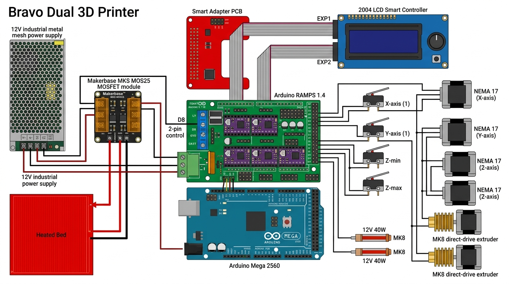

# 🖨️ Bravo Dual 3D Printer — Hardware & Firmware Archive

Comprehensive documentation, electrical blueprints, and configured Marlin 2.0.9.7 source code for the **Bravo Dual** custom dual-extrusion 3D printer.

---



---

## 📋 Machine Specifications

| Parameter | Specification |
| :--- | :--- |
| **Machine Name** | Bravo Dual |
| **Firmware** | Marlin 2.0.9.7 (Compiled by Syed) |
| **Controller Architecture** | Arduino Mega 2560 (8-bit AVR, 16 MHz) |
| **Shield & Driver Board** | RAMPS 1.4 / 1.6 (`BOARD_RAMPS_14_EEB`) |
| **Display & Input** | RepRapDiscount 2004 LCD + Full-Size SD Card Slot |
| **Printable Build Volume** | **275 mm (X) × 240 mm (Y) × 200 mm (Z)** |
| **Extruders** | Dual Extruders (2 Nozzles, 2 Heaters, 2 Thermistors) |
| **Nozzle / Filament** | 0.40 mm Nozzle / 1.75 mm Filament |
| **Power Supply** | Industrial 12V 20A–30A SMPS (Switching Power Supply) |
| **Communication Baud Rate** | `250,000 baud` |

---

## 📁 Repository Structure

```
├── Marlin-2.0.9.7/            # Complete, pre-configured Marlin source code (PlatformIO ready)
│   └── Marlin/
│       ├── Configuration.h     # Customized machine geometry, dual hotends, steps/mm
│       └── Configuration_adv.h # Advanced toolchange Z-hop & thermal controls
├── Configuration.h            # Standalone backup of Configuration.h
├── SMART_UPGRADE_GUIDE.md     # IoT, OctoPrint, Klipper & automation smart upgrade guide
├── PRINTER_STUDY_GUIDE.md     # Master technical study guide & Cura slicing cheat sheet
├── HARDWARE_REFERENCE.md      # Low-level pinout mappings, StepStick VREF formulas & build guide
├── wiring_and_circuits.md     # Complete electrical wiring blueprint (power, heaters, motors)
├── printer_eeprom_backup.md   # Raw EEPROM parameters dumped directly from microcontroller
└── full_diagnostic_report.md  # Live telemetry log (sensor readings, limit switch states)
```

---

## ⚡ Motion & Calibration Constants

* **Steps per Unit (`M92`):**
  * X Axis: `160.00 steps/mm`
  * Y Axis: `160.00 steps/mm`
  * Z Axis: `800.00 steps/mm`
  * Extruders (E0 / E1): `180.00 steps/mm` (Geared Extruder)
* **Maximum Speeds (`M203`):**
  * X / Y: `300 mm/s`
  * Z: `5 mm/s` (Do not exceed to prevent lead screw binding)
  * Extruder: `25 mm/s` (Keep retraction speed ≤ 25 mm/s)
* **Hotend PID (`M301`):** `P=22.20, I=1.08, D=114.00`
* **Toolchange Z-Hop (`M217`):** `2.00 mm`

---

## 🍰 Slicer Profile Recommendations (UltiMaker Cura)

When slicing single or dual-extruder prints in Cura:
* **Printer Bed Size:** `275 × 240 × 200 mm`
* **Origin at Center:** `Unchecked` (Front-left is 0,0)
* **Heated Bed:** `Enabled` (60°C for PLA)
* **Filament Diameter:** `1.75 mm`
* **Print Speed:** `45 – 55 mm/s`
* **Retraction Speed:** `25 mm/s`
* **Retraction Distance:** `4.0 – 5.5 mm` (Bowden) / `1.0 – 1.5 mm` (Direct Drive)

---

## 🛠️ How to Compile & Flash Firmware

### Using VS Code + PlatformIO (Recommended)
1. Open the `Marlin-2.0.9.7` folder in VS Code.
2. Install the **PlatformIO IDE** extension.
3. Click the **Build** checkmark icon (`✓`) in the bottom toolbar.
4. Connect the Arduino via USB and click **Upload** (`→`).

### Using Arduino IDE
1. Open `Marlin-2.0.9.7/Marlin/Marlin.ino`.
2. Select **Tools > Board > Arduino Mega 2560**.
3. Select your serial COM port.
4. Click **Verify** / **Upload**.
