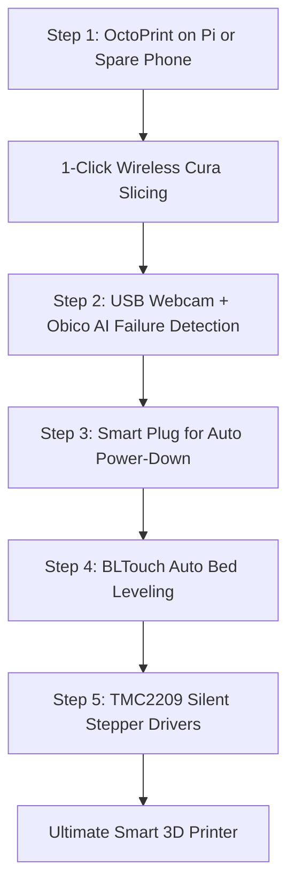

# 🚀 Smart 3D Printer Upgrade Guide — Bravo Dual

Transform the **Bravo Dual** (Arduino Mega 2560 + RAMPS 1.4) into a modern, connected, autonomous **Smart 3D Printer** (comparable to Bambu Lab or Prusa MK4 feature sets).

---

## 📑 Contents

1. [What Makes a Printer "Smart"?](#1-what-makes-a-printer-smart)
2. [Upgrade Architecture Comparison](#2-upgrade-architecture-comparison)
3. [Option 1: OctoPrint (Recommended — Easiest & Most Powerful)](#3-option-1-octoprint-recommended)
   - [Hardware Options (Raspberry Pi, Orange Pi, or $0 Old Phone)](#hardware-options)
   - [Setup & 1-Click Cura Integration](#setup--cura-integration)
   - [Top Smart Plugins](#top-smart-plugins)
4. [Option 2: Klipper + Mainsail / Fluidd (High-Speed & Advanced Math)](#4-option-2-klipper--mainsail--fluidd)
5. [Option 3: ESP3D Module (Ultra-Budget ~$4 Wireless)](#5-option-3-esp3d-module-ultra-budget)
6. [Hardware Add-ons for Complete Automation](#6-hardware-add-ons-for-complete-automation)
   - [Auto-Bed Leveling (BLTouch / 3D Touch)](#auto-bed-leveling-bltouch)
   - [Smart Plug Auto-Shutdown](#smart-plug-auto-shutdown)
   - [Silent Stepper Drivers (TMC2209 Drop-In)](#silent-stepper-drivers-tmc2209)
   - [Filament Runout Detection](#filament-runout-detection)
7. [Step-by-Step Implementation Roadmap](#7-step-by-step-implementation-roadmap)

---

## 1. What Makes a Printer "Smart"?

| Legacy Workflow (Current) | Modern Smart Workflow (Target) |
| :--- | :--- |
| Save G-code to full-size SD card | 1-Click "Print" directly inside Ultimaker Cura over Wi-Fi |
| Walk to printer, insert SD, turn knob | Start, pause, or cancel prints from your smartphone or browser |
| Stand over printer checking first layer | Live HD camera feed with night vision or LED lighting |
| Failed prints create giant "spaghetti" clumps | AI failure detection (Obico) automatically pauses print and alerts phone |
| Printer stays ON and consumes power all night | Wi-Fi smart plug automatically shuts off 220V power once hotend cools to < 50°C |
| Manual leveling with a sheet of paper | Auto-bed leveling probe (BLTouch) creates a 3D mesh compensating for warps |

---

## 2. Upgrade Architecture Comparison

| Upgrade Path | Hardware Needed | Cost (Approx) | Firmware Changes | Difficulty | Best For |
| :--- | :--- | :--- | :--- | :--- | :--- |
| **Path 1: OctoPrint** | Raspberry Pi, Orange Pi, Mini PC, or Old Android Phone | ₹0 – ₹3,500 ($0 – $40) | **Zero (Marlin stays untouched)** | ⭐ (Plug & Play) | Wireless printing, webcam, AI spaghetti detection, Cura integration |
| **Path 2: Klipper** | Raspberry Pi / Orange Pi + USB cable | ₹2,500 – ₹4,500 ($30 – $55) | Flash Klipper microcode to Mega 2560 | ⭐⭐⭐ (Intermediate) | 2x–3x faster print speeds (Input Shaping) + modern Mainsail GUI |
| **Path 3: ESP3D** | ESP8266 or ESP32 board | ₹250 – ₹450 ($3 – $5) | Enable 2nd serial port in Marlin | ⭐⭐ (Basic soldering/jumper) | Ultra-budget wireless G-code upload & basic controls |

---

## 3. Option 1: OctoPrint (Recommended)

OctoPrint is the undisputed gold standard for upgrading Marlin-based printers. It connects to the Arduino Mega’s existing USB Type-B port.

### Hardware Options

#### A. Old Android Phone via Octo4a (Cost: ₹0 / Free!)
If you have an old Android phone (Android 7.0 or higher) with a working camera and Wi-Fi:
1. Install **Octo4a** (OctoPrint for Android) from GitHub or F-Droid.
2. Connect the phone to the Arduino Mega using a **USB-C/Micro-USB OTG Y-Cable** (which allows simultaneous charging and USB data transmission).
3. **Benefits:** You get the CPU, RAM, Wi-Fi, touch display, and the phone's high-quality camera acting as the live stream all in one single device!

#### B. Single-Board Computer (Raspberry Pi or Orange Pi)
* **Raspberry Pi 3B+, 4B, or Raspberry Pi Zero 2 W**
* **Orange Pi Zero 3 / Orange Pi 3 LTS** (Budget-friendly alternative, ₹1,800 – ₹2,500)
* Any cheap USB webcam (e.g., Logitech C270 or generic 1080p webcam) plugs into the USB port.

#### C. Old Laptop or Mini PC
* If you have an old desktop, netbook, or Intel NUC running Windows or Linux, install OctoPrint via Docker or Python.

---

### Setup & Cura Integration

1. Flash **OctoPi** image to a MicroSD card (for Raspberry Pi) using Raspberry Pi Imager.
2. Connect USB cable from Pi/Phone to the Arduino Mega 2560.
3. Open browser on your PC or phone: `http://octopi.local`
4. Set Serial Connection:
   - **Port:** `/dev/ttyACM0` (or Auto)
   - **Baudrate:** `250000` (matches Bravo Dual Marlin firmware)
5. Install the **OctoPrint Connection** plugin in Ultimaker Cura (Marketplace):
   - Whenever you slice a model, click **"Print with OctoPrint"**.
   - The file transmits over Wi-Fi and begins printing immediately.

---

### Top Smart Plugins for OctoPrint

1. **Obico for OctoPrint (Formerly The Spaghetti Detective):**
   - Uses machine learning on the camera feed to detect print failures, layer shifts, or filament unspooling.
   - Automatically pauses the print and sends an alert to your phone.
2. **OctoApp / Printoid (Mobile Apps):**
   - Full native control apps for Android and iOS with push notifications.
3. **Octolapse:**
   - Moves the printhead to the corner at every layer change before snapping a frame, creating buttery-smooth stabilized timelapse videos.
4. **TP-Link Kasa / Tuya SmartPlug Plugin:**
   - Coordinates with your home smart plug to cut power once the hotend fan drops below 50°C.

---

## 4. Option 2: Klipper + Mainsail / Fluidd

If you want **speed and modern kinematics**, Klipper replaces Marlin's motion planner:

1. **How it operates:**
   - The Raspberry Pi runs Klipper and calculates all acceleration curves and kinematics.
   - The Arduino Mega 2560 simply runs a tiny C micro-program that flips stepper pins.
2. **Key Capabilities:**
   - **Input Shaping:** Uses an ADXL345 accelerometer (~₹300) temporarily mounted to the toolhead to measure resonant frequencies. Klipper mathematically eliminates vibrations, enabling **100–150 mm/s** prints without ringing or ghosting.
   - **Pressure Advance:** Calibrates nozzle backpressure for sharp 90° corners without over-extrusion blobs.
   - **Mainsail / Fluidd Web UI:** Clean, ultra-fast interface with full 3D G-code viewer.
3. **Transition Path:**
   - All pinouts for your RAMPS 1.4 (`X_STEP=54`, `X_DIR=55`, `Y_STEP=60`, `Z_STEP=46`, `E0_STEP=26`, etc.) and step rates (`160`, `160`, `800`, `180`) already documented in [`HARDWARE_REFERENCE.md`](HARDWARE_REFERENCE.md) map 1:1 into a Klipper `printer.cfg`.

---

## 5. Option 3: ESP3D Module (Ultra-Budget ~$4 Wireless)

If you only want basic wireless file uploading and web controls without an external computer or camera:

1. **Hardware:** ESP8266 (NodeMCU / D1 Mini) or ESP32 module (Cost: ₹250 – ₹400).
2. **Wiring to RAMPS 1.4 AUX-1 Header:**
   - `5V` -> RAMPS `5V`
   - `GND` -> RAMPS `GND`
   - `RX` -> RAMPS `TX0` (Pin D1)
   - `TX` -> RAMPS `RX0` (Pin D0)
3. **Software:**
   - Flash open-source **ESP3D-WEBUI** firmware to the ESP module via Arduino IDE.
   - Marlin configuration needs a secondary serial port enabled in `Configuration.h`:
     ```cpp
     #define SERIAL_PORT 0
     #define SERIAL_PORT_2 1    // Or AUX serial channel
     ```
4. **Result:** Connect to `http://192.168.x.x` from any browser on your home Wi-Fi to jog axes, set nozzle/bed temperatures, and send G-code commands.

---

## 6. Hardware Add-ons for Complete Automation

To achieve true parity with high-end commercial printers, consider adding these hardware accessories:

### Auto-Bed Leveling (BLTouch / 3D Touch)
* **Sensor:** Genuine Antclabs BLTouch or 3D Touch clone (~₹900 – ₹1,800).
* **Wiring on RAMPS 1.4:**
  * **Servo Header (3 pins):** Signal to `Pin 11` (Servo 1), `+5V`, `GND`.
  * **Z-Probe (2 pins):** Black/White wires to `Z-Min Endstop` (Pin 18 & GND).
* **Benefit:** Before every print, the probe touches the bed at 9 or 16 points. The printer automatically angles and flexes the Z-axis motors in real time to guarantee a perfect first layer even on uneven glass or aluminum.

### Smart Plug Auto-Shutdown
* **Hardware:** Any standard Wi-Fi plug (TP-Link Tapo, Tuya, Sonoff, Wipro, ₹600 – ₹900).
* **Logic:**
  1. Print finishes -> Slicer executes end G-code `M104 S0` (Hotend off) and `M140 S0` (Bed off).
  2. OctoPrint or Home Assistant monitors hotend thermistor until `T < 50°C` (ensuring heatbreak cooling fan prevents heat creep).
  3. API command turns off the smart plug, cutting all AC mains power.

### Silent Stepper Drivers (TMC2209 Drop-In)
* **Current state:** TI DRV8825 drivers produce noticeable high-frequency motor whine.
* **Upgrade:** Trinamic TMC2208 or TMC2209 StepStick modules (~₹300 each).
* **Installation:** Pull out the DRV8825s, drop in the TMC2209s (verify orientation: `DIR` and `GND` pins must match), and adjust the small potentiometer $V_{REF}$ to ~`0.85V`.
* **Result:** **Silent printing (`StealthChop2`)** — the machine becomes virtually silent except for the cooling fans!

### Filament Runout Detection
* **Sensor:** Simple optical or mechanical limit switch switch module (~₹150).
* **Connection:** Connects to RAMPS unused endstop pins (e.g., `X-Max` Pin 2 or `Y-Max` Pin 15).
* **Action:** When filament runs out mid-print, Marlin triggers `M600` (Filament Change procedure), parks the nozzle, beeps the LCD, and waits for a new spool.

---

## 7. Step-by-Step Implementation Roadmap



### Quickest Win Today:
If you have an old Android phone or a spare Raspberry Pi:
1. Connect it to the Arduino Mega via USB cable.
2. Launch OctoPrint/Octo4a at 250,000 baud.
3. In under 30 minutes, you will have wireless control, Cura integration, and live camera streaming without touching a single screwdriver or line of code!
